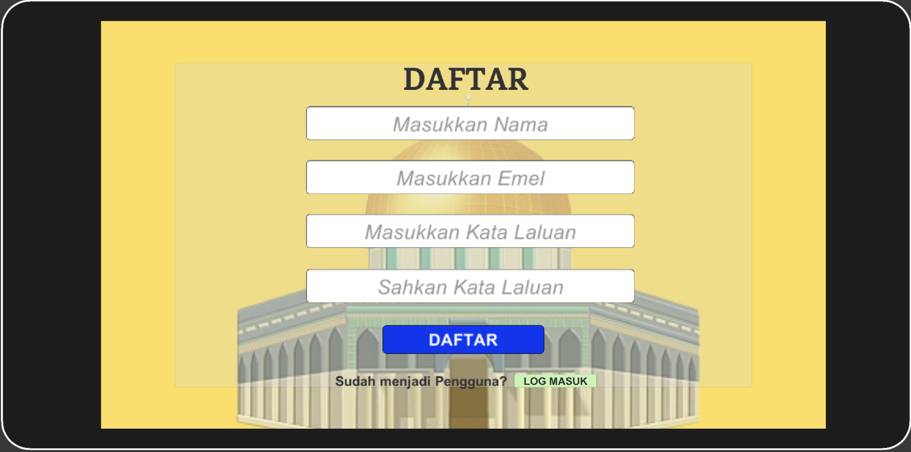
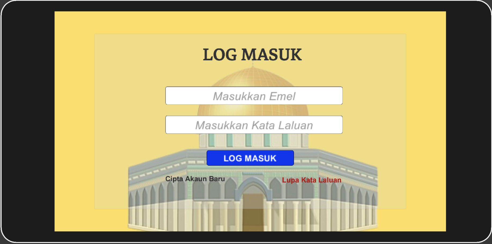
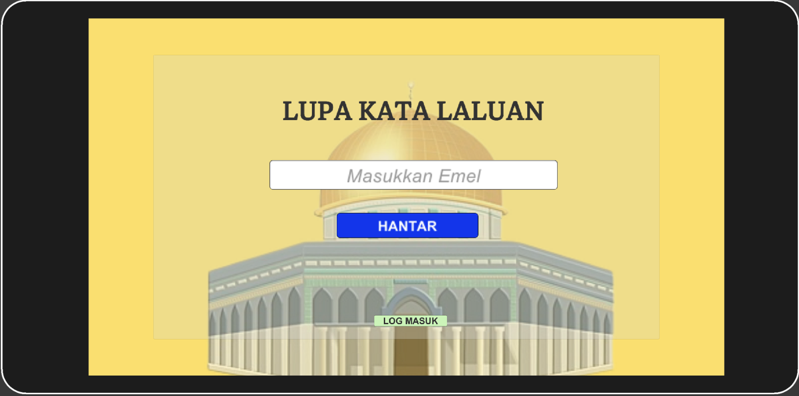
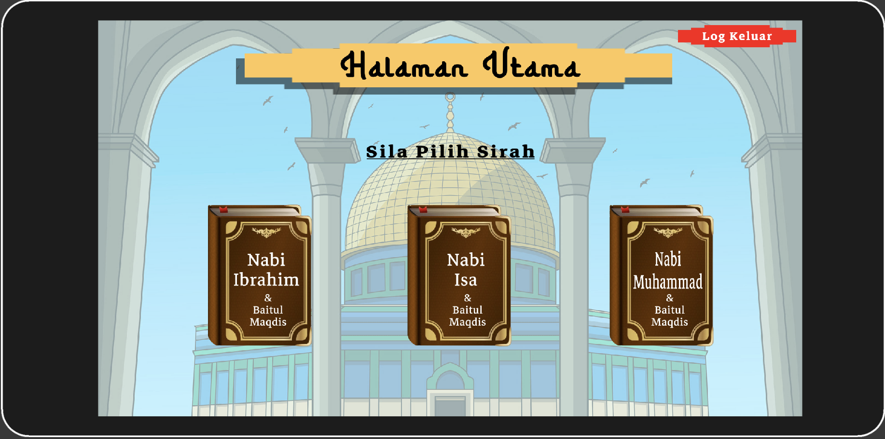
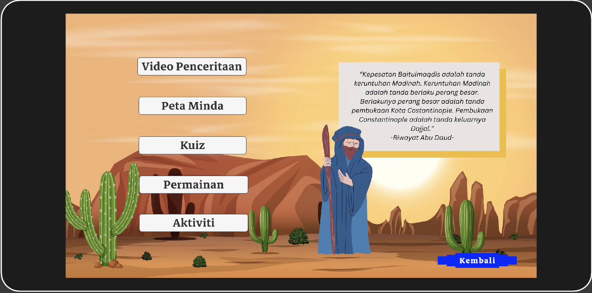
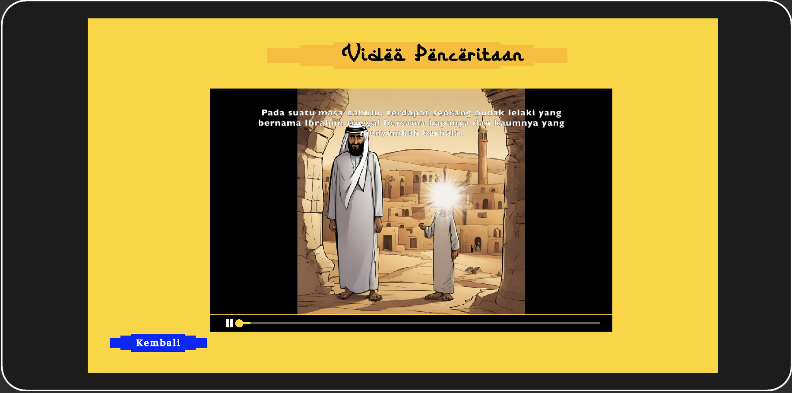
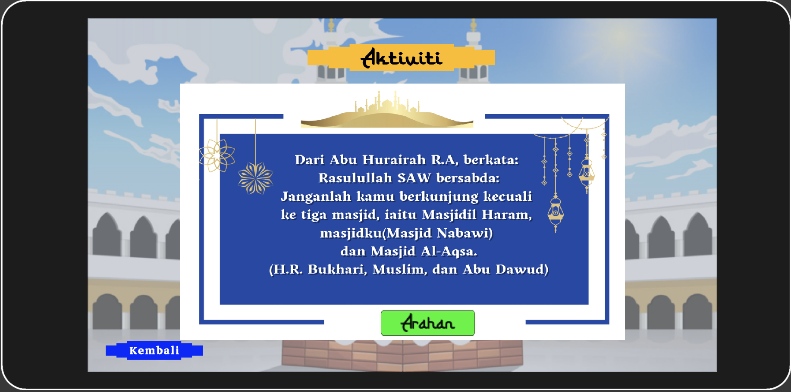

# nabi-aqsa
## Overview

Nabi&amp;Aqsa: An Interactive Learning Application to Introduce Baitul Maqdis for Children is developed to nurture children in learning about Baitul Maqdis that uses interactive multimedia to stimulate their interest and appreciation in learning history and the prophets related to Baitul Maqdis.

Language: Malay

## Platform

Using Unity with backend engineered using Firebase.

## Features

* Login/Register/Logout
* Storytelling Video
* Mind Map
* Quiz
* Matching Game
* Mini Activity

### Screens

